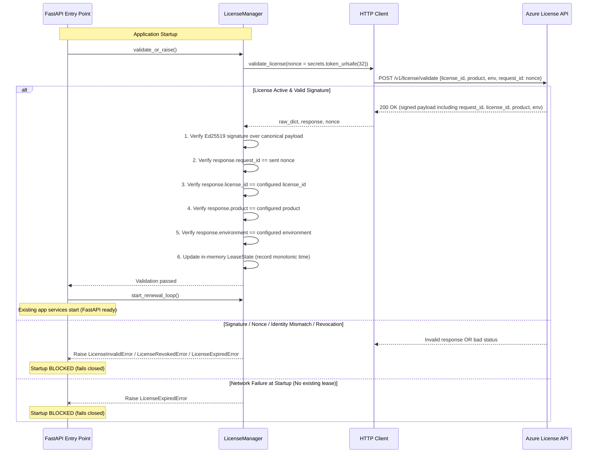

# Azure-Backed Ed25519 Licensing Subsystem (Production Hardened)

## 1. Overview & Architecture

The Alteryx ETL Rationalisation Tool uses an **online license + short-term lease** model with **Ed25519 cryptographic authentication**. Authorization authority resides exclusively on the Azure side — the client application cannot independently decide license validity based on its local clock.

```
┌─────────────────────────────────────────────────────────────────┐
│                    COMPANY AZURE INFRASTRUCTURE                 │
│                                                                 │
│  ┌───────────────────────┐         ┌─────────────────────────┐  │
│  │   Azure Key Vault     │         │    Azure License API    │  │
│  │                       │         │                         │  │
│  │  Ed25519 Private Key  │────────▶│  Server-side Time       │  │
│  │  (NEVER distributed)  │         │  Authoritative Status   │  │
│  └───────────────────────┘         │  POST /v1/license/...   │  │
│                                    └────────────┬────────────┘  │
└─────────────────────────────────────────────────┼───────────────┘
                                                  │ HTTPS
                                       Signed Lease Response
                                       Bound to Client Nonce
                                                  │
┌─────────────────────────────────────────────────┼───────────────┐
│              CLIENT DATABRICKS / TARGET RUNTIME │               │
│                                                 ▼               │
│  ┌───────────────────────────────────────────────────────────┐  │
│  │                    FastAPI Lifespan                       │  │
│  │                                                           │  │
│  │  1. validate_or_raise() ──▶ blocks startup if invalid     │  │
│  │  2. start_renewal_loop() ─▶ background asyncio task       │  │
│  │                                                           │  │
│  │  ┌─────────────────────────────────────────────────────┐  │  │
│  │  │            Embedded License Manager                 │  │  │
│  │  │                                                     │  │  │
│  │  │  • Ed25519 Public Key (Embedded Trust Anchor)       │  │  │
│  │  │  • Cryptographic Nonce/request_id binding           │  │  │
│  │  │  • License ID, Product, & Environment validation    │  │  │
│  │  │  • Monotonic elapsed time offline grace tracking    │  │  │
│  │  │  • In-memory LeaseState (never saved to disk)       │  │  │
│  │  │  • Fail-closed startup & renewal behavior           │  │  │
│  │  │  • Production licensing permanently enabled         │  │  │
│  │  └─────────────────────────────────────────────────────┘  │  │
│  └───────────────────────────────────────────────────────────┘  │
└─────────────────────────────────────────────────────────────────┘
```

---

## 2. Hardened Protocol & Nonce Binding

Every interaction with the Azure License API is protected against replay attacks and cross-tenant substitution using a cryptographic nonce:



---

## 3. Production Security Guarantees

### A. Production Licensing Cannot Be Disabled
- In production builds, licensing is **permanently enabled**.
- `ALTERYX_LICENSE_ENABLED` is **removed as a client bypass**; setting `ALTERYX_LICENSE_ENABLED=false` has zero effect.
- The compiled native package enforces validation on startup.

### B. Production Public Key Cannot Be Replaced
- The verification key is **strictly the embedded public key** compiled into the binary.
- Client environment variables (`ALTERYX_LICENSE_PUBLIC_KEY`) are **strictly ignored** in production builds, preventing clients from supplying custom signing keypairs.

### C. Cryptographic Binding (Nonce)
- A fresh cryptographically secure random token (`secrets.token_urlsafe(32)`) is generated for every validation request.
- The server echoes this token in `request_id`.
- The token is included in the canonical signed payload and verified before accepting the response.

### D. Multi-Attribute Identity Verification
Following signature validation, the client explicitly asserts:
- `response.request_id == sent_nonce`
- `response.license_id == configured_license_id`
- `response.product == configured_product`
- `response.environment == configured_environment`

If any field fails to match, the response is rejected immediately.

### E. Server-Authoritative Time & Monotonic Offline Grace
- Server timestamp (`server_time`) and server-issued expiry (`lease_expires_at`) govern license duration.
- Client wall clock is never used to determine contract validity.
- During temporary API outages, elapsed offline grace is measured using **monotonic time** (`time.monotonic()`), preventing local wall-clock jumps or resets from extending grace.
- **Cold startup without prior lease always fails closed** if the API is unreachable.

---

## 4. Key Management & Separation

| Key | Location | Access |
|---|---|---|
| **Ed25519 Private Key** | Company Azure Key Vault | Company License API only. **NEVER** placed in repo, logs, client artifact, or environment. |
| **Ed25519 Public Key** | Embedded in client binary | Publicly verifiable trust anchor. Safe to distribute. |

---

## 5. API Contract Specifications

### Request: `POST {ALTERYX_LICENSE_API_URL}/v1/license/validate`

```json
{
  "license_id": "ALT-CLIENT-001",
  "product": "alteryx-etl",
  "client_instance_id": "4b689a74-954f-4d56-a19b-77f6b957e841",
  "environment": "production",
  "request_id": "eJ7z9P-xK2Lm3NoP4Q5Rs6Tu7Vw8Xy9Z0Ab1Cd2Ef3G"
}
```

### Response (HTTP 200)

```json
{
  "license_id": "ALT-CLIENT-001",
  "product": "alteryx-etl",
  "environment": "production",
  "client_instance_id": "4b689a74-954f-4d56-a19b-77f6b957e841",
  "request_id": "eJ7z9P-xK2Lm3NoP4Q5Rs6Tu7Vw8Xy9Z0Ab1Cd2Ef3G",
  "status": "active",
  "lease_expires_at": "2026-10-06T14:00:00Z",
  "server_time": "2026-10-05T14:00:00Z",
  "features": {
    "workflow_analysis": true,
    "portfolio_rationalisation": true,
    "python_translation": true,
    "export_reports": true
  },
  "message": "License active and in good standing.",
  "signature": "O3D0N+eF...=="
}
```

### Canonical Signed Payload Format

The signature is computed over compact UTF-8 JSON with sorted keys, excluding the `signature` field:

```json
{"client_instance_id":"4b689a74-954f-4d56-a19b-77f6b957e841","environment":"production","features":{"export_reports":true,"portfolio_rationalisation":true,"python_translation":true,"workflow_analysis":true},"lease_expires_at":"2026-10-06T14:00:00Z","license_id":"ALT-CLIENT-001","message":"License active and in good standing.","product":"alteryx-etl","request_id":"eJ7z9P-xK2Lm3NoP4Q5Rs6Tu7Vw8Xy9Z0Ab1Cd2Ef3G","server_time":"2026-10-05T14:00:00Z","status":"active"}
```

---

## 6. Environment Variables (Runtime Configuration)

| Variable | Required | Default | Purpose |
|---|---|---|---|
| `ALTERYX_LICENSE_API_URL` | Yes | *(none)* | Base URL for company Azure License API. |
| `ALTERYX_LICENSE_ID` | Yes | *(none)* | Unique tenant / client license identifier. |
| `ALTERYX_LICENSE_PRODUCT` | No | `alteryx-etl` | Product identifier in validation requests. |
| `ALTERYX_LICENSE_ENVIRONMENT` | No | `production` | Deployment environment tag (`production`, `staging`, `test`). |
| `ALTERYX_LICENSE_GRACE_SECONDS` | No | `259200` (72h) | Allowed offline grace period in seconds. |
| `ALTERYX_LICENSE_HEARTBEAT_SECONDS` | No | `3600` (1h) | Lease renewal attempt cadence in seconds. |

*Note: `ALTERYX_LICENSE_ENABLED`, `ALTERYX_LICENSE_PUBLIC_KEY`, and `ALTERYX_LICENSE_LEASE_SECONDS` are intentionally not configurable by the client at runtime.*

---

## 7. Fail-Closed Enforcement Matrix

| Condition | Action Taken | Application State |
|---|---|---|
| Missing URL or License ID | Raise `LicenseConfigurationError` | Fails startup |
| Invalid Ed25519 signature | Raise `LicenseSignatureError` | Fails startup / shuts down |
| Mismatched request_id (nonce) | Raise `LicenseInvalidError` | Fails startup / shuts down |
| Mismatched client_instance_id | Raise `LicenseInvalidError` | Fails startup / shuts down |
| Mismatched license_id | Raise `LicenseInvalidError` | Fails startup / shuts down |
| Mismatched product/environment | Raise `LicenseInvalidError` | Fails startup / shuts down |
| Status = `expired` | Raise `LicenseExpiredError` | Fails startup / shuts down |
| Status = `revoked` | Raise `LicenseRevokedError` | Fails startup / shuts down |
| Status = `suspended` | Raise `LicenseExpiredError` | Fails startup / shuts down |
| Cold startup + API unreachable | Raise `LicenseExpiredError` | Fails startup |
| Runtime outage (monotonic <= grace) | Log warning; retain valid lease | Continues running |
| Runtime outage (monotonic > grace) | Trigger `SIGTERM` | Shuts down |
| Failed heartbeat (transient network glitch) | Retain valid lease; retry | Continues running |

---

## 8. Security Limitations & Threat Model

> [!WARNING]
> **Tamper Resistance Boundary**: The client controls its own Databricks/VM runtime environment. Software-only protection cannot guarantee absolute, permanent tamper resistance against a fully privileged adversary with root access, kernel debuggers, or an arbitrarily modified Python runtime.

**What This Subsystem Hardening Accomplishes**:
- Eliminates environment-variable bypasses (`ALTERYX_LICENSE_ENABLED`, `ALTERYX_LICENSE_PUBLIC_KEY`).
- Cryptographically binds responses to individual client requests via nonces.
- Enforces multi-tenant isolation by strictly verifying license ID, product, and environment.
- Prevents monotonic elapsed time manipulation during runtime outages.
- Guarantees authoritative control remains in Azure Key Vault and the Azure License Service.
